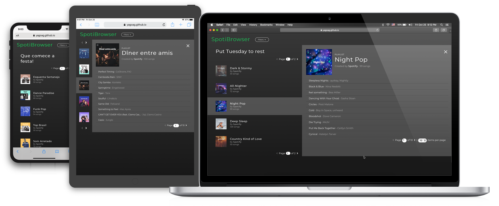

# SpotiBrowser

This app will allow you to browse and filter the featured playlists on Spotify.

If you have the Spotify app installed in your computer, clicking a playlist will open it in your app.

The playlists will be updated every 30 seconds so you don't miss any new tunes on the playlists by Spotify.

## Notes on Spotify authorization

We can access the Spotify API for featured playlists by either getting a user or an application token (since the playlists are public and do not necessarily need user auth).

User auth can be done in a refresheable token way (which will run into CORS issues if tried to be done client-side) or using a regular non-refresheable token (which could be done on the client side).

Even though this could be done on the client side, I have decided to use the application token instead, so a user without a Spotify account would be able to use the app as well. Because of that we would run into CORS issues, so I have created a simple development server which will make a request to the Spotify API and return it.

## Running the service

First of all, you will need to update the `.env` file. I have left the file on the repo, so you know which variables you need to set. Some of them already have some defaults, which you usually wouldn't need to change.

This project was created with [Create React App](https://github.com/facebook/create-react-app), so any commands in there will still work.

Because of the Spotify authentication though, you will require to have a server capable of returning the Spotify API key.

For dev purposes, you could run the server I have created using `npm run server` or you can also run `npm run dev`, which will run server and front-end concurrently in a single terminal window.

## What could have been done better

You can watch for new features and enhancements on the [Kanban](https://github.com/yagoag/spotify-featured-browser/projects/1) of the project
