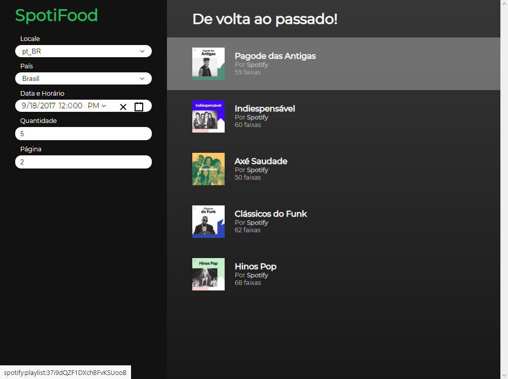

# Spotify Featured Browser

This app will allow you to browse and filter the featured playlists on Spotify.

If you have the Spotify app installed in your computer, clicking a playlist will open it in your app.

The playlists will be updated every 30 seconds so you don't miss any new tunes on the playlists by Spotify.

## Notes on Spotify authorization

We can access the Spotify API for featured playlists by either getting a user or an application token (since the playlists are public and do not necessarily need user auth).

User auth can be done in a refresheable token way (which will run into CORS issues if tried to be done client-side) or using a regular non-refresheable token (which could be done on the client side).

Even though this could be done on the client side, I have decided to use the application token instead, so a user without a Spotify account would be able to use the app as well. Because of that we would run into CORS issues, so I have created a simple development server which will make a request to the Spotify API and return it.

## Running the service
First of all, you will need to update the `.env` file. I have left the file on the repo, so you know which variables you need to set. Some of them already have some defaults, which you usually wouldn't need to change.

This project was created with [Create React App](https://github.com/facebook/create-react-app), so any commands in there will still work.

Because of the Spotify authentication though, you will require to have a server capable of returning the Spotify API key.

For dev purposes, you could run the server I have created using `npm run server` or you can also run `npm run dev`, which will run server and front-end concurrently in a single terminal window.

## What could have been done better
There are some items that were on my list for completing the application, but that could not be accomplished due to the lack of more available time. They are:

* **Better styling on the date/time picker**

  Most of the styling of this component is default and might not match the rest of the layout of the page

* **Fix date/time conversion based on the filter API**
  
  Since the filter API currently returns a date/time patters which is really close do ISO format (excluding the Z for UTC timezone) and the ISO format works with the Spotify API, I have left axios using the default behavior of sending the Date field in UTC format.
  
  We could use a library like `moment.js` to convert it into the pattern returned by the filter API, so compatibility is not broken in the future.

* **Better state management**

  Because the app was created using hooks, state management could be improved a little by converting some function components into class components and making some changes, such as merging multiple state changes into a single `setState` and making a better usage of the component lifecycle (especially on the 30 second automatic refresh, since useEffect joing multiple cycles into a single function)

* **App localization**

  The response from te Spotify API does not really vary by much when Locale is changed. We could try to make use of the Locale filter to also translate our whole app (since there are few words in that, anyway). I have stick with Portuguese, though, since that is tha language the filter API is returning on the names.

* **Better pagination**

  Pagination could have better looks/usability if moved to the end and/or top of the playlists page, but I have decided to keep if as a regular filter to allow for more flexibility based on what's returned by the filter API (we could, in the future, not have offset or page number in there, which could cause our app to break).

* **Prettier error messages on filter validation**

  Currently, the error messages are just an `alert()`, which is not exactly the best looking option for showing errors. We could, for example, add an error message below the filter field. This would require some change in the state management, so I have kept it this way for now.

* **Add (more?) tests**

  I did not have much time no create any new tests other than the (default from create-react-app) "renders without crashing" test case.

* **Saving filters between sessions**

  Not completely necessary, but it could come in handy for someone that would use this app a lot and would like the filters to be saved.
